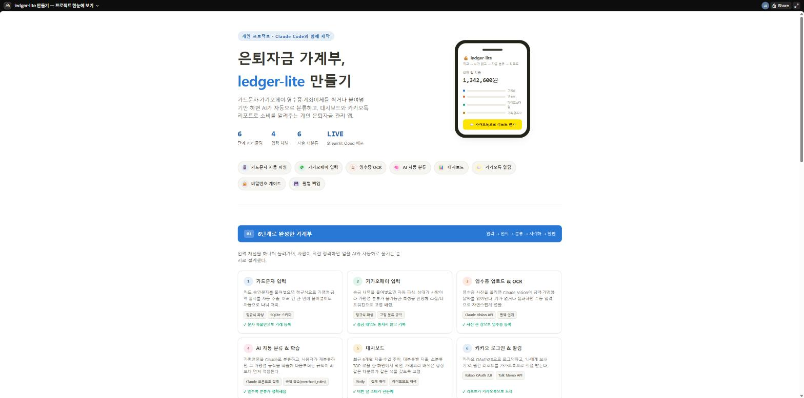

# ledger-lite

은퇴 후 생활비 소비를 촬영/입력만 하면 AI가 자동 분류·분석해주는 1인용 모바일 우선 AI 가계부 MVP.

> 찍고 → AI가 읽고 → 자동 분류 → 대시보드로 확인 → 카카오톡으로 리포트 받기

연금(IRP/연저)·투자 관련 데이터/분석은 명시적으로 제외한다 (별도 프로젝트에서 관리). 연금 인출액이
입금되는 경우 "출처 분석 없이 금액만 수입으로 기록"하는 정도로만 취급한다. 자세한 배경은
[docs/PROJECT_BRIEF.md](docs/PROJECT_BRIEF.md) 참고.

## 프로젝트 한눈에 보기

[](docs/project-overview.html)

앱 소개와 개발 프로세스를 정리한 한 페이지 요약. 위 이미지를 클릭하거나
[docs/project-overview.html](docs/project-overview.html)을 다운로드해 브라우저로 열면 된다
(빌드 없이 파일 하나로 동작).

## 개발 단계

| 단계 | 내용 | 상태 |
|---|---|---|
| 1 | 프로젝트 구조 & DB 스키마 | ✅ |
| 2 | 영수증 업로드 + 수동 입력 MVP | ✅ |
| 3 | OCR 연결 (Claude Vision) | ✅ |
| 4 | AI 분류 연결 (Claude API) | ✅ |
| 5 | 대시보드 (Streamlit + Plotly) | ✅ |
| 6 | 카카오 로그인 & 알림 | ✅ |

## 기술 스택

Streamlit + 로컬 SQLite. OCR/분류는 Claude API로 통합 (3~4단계). 차트는 Plotly (5단계).

## 프로젝트 구조

```
app/
  config.py            # 환경변수, 경로 설정
  main.py              # Streamlit 진입점 (홈 화면)
  db/
    schema.sql          # DB 스키마 (DDL)
    connection.py        # SQLite 연결/초기화
    seed_categories.py   # 카테고리 기본값 시드
  parsers/              # 카드문자/카카오페이 정규식 파서 (AI 미사용)
    card_sms_parser.py
    kakaopay_parser.py
  services/              # capture -> ocr_result -> receipt -> classification 파이프라인
    capture_service.py
    category_service.py    # category_enum_options() - AI 구조화 출력용 카테고리 enum 공용 헬퍼
    receipt_service.py    # merchant_rules 학습 루프 포함
    vision_service.py      # Claude Vision OCR+분류 (structured outputs)
    classification_service.py  # 카드문자 가맹점명 텍스트 분류 (structured outputs)
    dashboard_service.py    # 대시보드 집계 쿼리 (월별 요약, 카테고리별, 추이)
    kakao_service.py       # 카카오 로그인(OAuth) + 나에게 보내기 메시지 전송
  pages/                 # Streamlit 멀티페이지
    1_카드문자_입력.py
    2_카카오페이_입력.py
    3_영수증_업로드.py
    4_은행이체_수동입력.py
    5_거래내역.py
    6_대시보드.py
    7_카카오_알림.py
data/
  ledger.db             # 로컬 SQLite DB 파일 (git에 커밋하지 않음)
  receipt_images/        # 업로드된 영수증 이미지 저장 위치
  kakao_token.json       # 카카오 OAuth 토큰 (git에 커밋하지 않음)
tests/
  fixtures/             # 카드문자/카카오페이/영수증 샘플 데이터
  test_db_schema.py      # DB 스키마 검증 테스트
  test_parsers.py         # 파서 단위 테스트
  test_receipt_service.py # 파이프라인/학습 루프 테스트 (모킹된 AI 분류 경로 포함)
  test_vision_service.py  # OCR 오프라인(키 없음 폴백) 테스트
  test_classification_service.py  # 텍스트 분류 오프라인 테스트
  test_dashboard_service.py  # 집계 쿼리 테스트
  test_kakao_service.py  # OAuth/메시지 전송 오프라인 테스트 (requests 모킹)
```

## DB 스키마 설계

수집(Collector)과 분석(Analyzer)을 테이블 레벨에서 분리한다.

- **수집 계층**: `captures`(원본 입력) → `ocr_results`(파싱/OCR 결과). 원본은 절대 수정하지 않고
  그대로 보존하며, 파싱/분류 로직이 바뀌어도 재처리할 수 있게 한다.
- **분석 계층**: `receipts`(확정된 거래) + `classifications`(카테고리 분류, 이력 보존).
  `classifications`는 receipt당 여러 행이 쌓일 수 있고(AI 최초 분류 → 사용자 재분류),
  `is_current=1`인 행만 유효하다.
- **카테고리**: `categories` 테이블에 지출 5대분류(고정비/변동비/라이프스타일비/가족·경조사비/
  비정기 대형지출) + 각 소분류, 수입 2종(연금인출유입/기타수입), 시스템 상태값(미분류·확인필요)을
  통합 관리한다.
- **학습 규칙**: `merchant_rules`에 사용자가 재분류한 가맹점/상대방 패턴을 쌓아 다음 자동분류에 반영한다.

### 입력 채널별 처리 방식

| 채널 | captures.source_type | 처리 |
|---|---|---|
| 카드 승인문자 | `card_sms` | 정규식 파싱 → `ocr_results` → 규칙 매칭 우선, 없으면 Claude 텍스트 분류 |
| 카카오페이 송금 | `kakaopay` | 정규식 파싱 → `ocr_results` → **라이프스타일비 > 소셜/네트워킹 고정 배정** |
| 영수증 촬영 | `receipt_image` | Claude Vision이 OCR+분류를 한 번에 처리 → `ocr_results` → AI 분류 (키 없으면 수동 입력) |
| 은행 계좌이체 | `bank_manual` | 자동 파싱 없음. `receipts`에 `capture_id=NULL`로 직접 수동 입력 |

연금/투자 관련 테이블은 존재하지 않는다.

## 2단계: 입력 채널 & 학습 루프

카드문자/카카오페이는 정규식 파싱 후 다음 우선순위로 기본 분류한다.

1. `merchant_rules`에 사용자가 학습시킨 규칙이 있으면 적용 (`classified_by='rule'`)
2. 카카오페이는 항상 라이프스타일비 > 소셜/네트워킹으로 고정 배정
3. 카드문자는 규칙이 없으면 Claude로 가맹점명 기반 분류 시도 (4단계, `classified_by='ai'`)
4. AI도 실패/미설정이거나 미분류로 판단하면 "미분류·확인필요" 상태로 두고 '거래내역'에서 확인 대기

'거래내역' 페이지에서 카테고리를 수정하면 해당 가맹점명 기준 규칙이 `merchant_rules`에 저장되어,
같은 가맹점의 다음 카드문자부터 자동으로 적용된다 (PROJECT_BRIEF 6절의 학습 요구사항).

중복 붙여넣기는 `captures.raw_text` 일치 여부로 감지해 건너뛴다.

## 3단계: Claude Vision OCR + 분류

영수증 이미지는 Claude Opus 5에 **한 번의 API 호출**로 OCR과 카테고리 분류를 동시에 요청한다
(`app/services/vision_service.py`). 카테고리는 자유 텍스트가 아니라 `output_config.format`의
JSON Schema `enum`으로 강제해서, 모델이 5대분류 체계 밖의 카테고리를 만들어낼 수 없게 한다.

- `ANTHROPIC_API_KEY`가 없으면 `VisionNotConfiguredError`를 던지고, 영수증 업로드 페이지는
  2단계에서 만든 수동 입력 폼으로 자연스럽게 안내한다 (PROJECT_BRIEF 6절: 키 없이도 로컬 모드로
  전체 흐름을 테스트할 수 있어야 한다).
- AI가 분류한 거래는 항상 `review_status='needs_review'`로 시작해 '거래내역' 페이지에서 사용자
  확인을 거친다. 사용자가 수정하면 2단계의 `merchant_rules` 학습 루프에도 그대로 반영된다.
- 단순 인식/분류 작업이라 `output_config.effort`는 `low`로 설정해 비용과 지연을 낮췄다.

## 4단계: 카드문자 AI 분류 연결

카카오페이(고정 배정)와 영수증(3단계 Vision)은 이미 자동 분류가 있어, 4단계는 **카드문자** 채널에
남아있던 "규칙 없으면 무조건 미분류" 로직을 보강한다 (`app/services/classification_service.py`).

- `merchant_rules`에 학습된 규칙이 없는 새 가맹점은 가맹점명(+금액)만으로 Claude에게 업종을
  추정시켜 분류한다. vision_service와 마찬가지로 카테고리는 `output_config.format`의 JSON
  Schema enum으로 강제한다 (공용 헬퍼: `category_service.category_enum_options()`).
- AI가 "미분류"로 판단하거나 API 키가 없거나 호출이 실패하면, 기존과 동일하게
  "미분류·확인필요"(`classified_by='default'`)로 폴백한다 — 항상 안전한 기본값을 보장한다.
- AI로 분류된 거래도 `needs_review`로 시작하며, 사용자가 거래내역에서 확인/수정하면 그대로
  `merchant_rules`에 학습되어 같은 가맹점의 다음 문자부터는 규칙이 우선 적용된다.

## 5단계: 대시보드

`app/services/dashboard_service.py`가 순수 SQL 집계를 담당하고, `app/pages/6_대시보드.py`가
Plotly로 시각화한다.

- **최근 6개월 지출·수입 추이** — 선 그래프. 하나의 y축(원 단위)에 두 시리즈만 그려 이중축을
  쓰지 않는다. x축은 "YYYY-MM" 카테고리로 고정한다 (그냥 두면 Plotly가 날짜로 오인해 주 단위로
  쪼갠다).
- **대분류별 지출** — 5대분류를 고정 색상(파랑/주황/아쿠아/노랑/마젠타)의 가로 막대로 비교한다.
  부분-전체 관계는 파이 차트 대신 막대 비교가 더 정확하게 읽혀서 막대를 선택했다. "미분류·확인필요"는
  카테고리컬 색이 아닌 무채색(회색)으로 구분해 실제 분류와 섞이지 않게 했다.
  대분류 색상은 `categories` 시드 순서와 고정되어 있어 데이터가 바뀌어도 같은 대분류는 항상 같은
  색을 갖는다.
- **소분류 지출 TOP 10 / 카테고리별 상세 테이블** — 미분류 항목도 포함해 상세 테이블 합계가 항상
  KPI의 "지출" 값과 정확히 일치하도록 했다 (확인이 얼마나 밀려있는지 숨기지 않는다).
- 월 선택 셀렉트박스로 과거 달을 조회할 수 있고, 거래가 아직 없으면 빈 차트 대신 안내 메시지를 보여준다.

## 6단계: 카카오 로그인 & 알림

`app/services/kakao_service.py`가 카카오 로그인(OAuth 인가 코드 방식)과 카카오톡
'나에게 보내기'(`POST /v2/api/talk/memo/default/send`, 별도 사용권한 신청 불필요)를 담당한다.

- Redirect URI가 카카오 개발자 콘솔에 홈 화면(`KAKAO_REDIRECT_URI`, 기본
  `http://localhost:8501`)으로 고정 등록되어 있어, 로그인 콜백(`?code=...`)은 서브페이지가
  아니라 `app/main.py`에서 받아 토큰을 교환한다.
- 1인용 로컬 앱이므로 OAuth 토큰은 DB가 아니라 `data/kakao_token.json`에 저장한다 (다른 로컬
  전용 파일들과 동일하게 git에 커밋하지 않음). access_token 만료 시 refresh_token으로 자동
  갱신하고, refresh_token 자체가 만료되면 재로그인을 안내한다.
- `KAKAO_REST_API_KEY`가 없으면 '카카오 알림' 페이지가 설정 안내로 대체된다 (다른 AI 기능들과
  동일한 로컬 모드 폴백 원칙).
- 카카오 콘솔에서 "카카오 로그인" 클라이언트 시크릿을 활성화한 앱은 `KAKAO_CLIENT_SECRET`도
  `.env`에 넣어야 토큰 교환/갱신이 성공한다 (미설정 시 요청에서 자동으로 생략됨).
- 리포트 내용은 `dashboard_service.build_monthly_report_text()`가 그 달의 지출/수입/순증감/
  대분류별 지출을 텍스트로 정리해서 만든다.
- 실제 카카오 로그인은 사용자의 카카오 계정 인증이 필요해 자동화 테스트나 브라우저 자동화로
  대신 수행하지 않았다 — 인가 URL 생성, 토큰 교환/갱신, 메시지 전송 요청 구성은 `requests`를
  모킹한 오프라인 테스트로 검증했고, 실제 로그인/전송은 사용자가 '카카오 알림' 페이지에서
  직접 확인해야 한다.

## 시작하기

```bash
python -m venv .venv
.venv/Scripts/activate   # Windows
pip install -r requirements.txt
cp .env.example .env      # 필요 시 값 채우기 (1단계는 비워둬도 동작)

streamlit run app/main.py
```

첫 실행 시 `data/ledger.db`가 자동 생성되고 스키마/카테고리 시드가 채워진다.

## Streamlit Community Cloud 배포 (폰 접속용)

PROJECT_BRIEF 3절의 배포 계획: "우선 로컬 실행 → 안정화 후 Streamlit Community Cloud → 폰 접속용".

1. [share.streamlit.io](https://share.streamlit.io)에 GitHub 계정으로 로그인
2. "New app" → 이 저장소(`jgjeong730/2026_ledger_lite`) 선택, 브랜치 `main`, 메인 파일 경로
   `app/main.py` 입력 후 배포
3. 앱 설정(Settings) → **Secrets**에 아래 내용을 TOML 형식으로 붙여넣기 (`.env`가 아니라 Streamlit
   Cloud 고유의 시크릿 관리 방식이라 `app/config.py`가 `st.secrets`도 함께 읽도록 되어 있다):
   ```toml
   SUPABASE_DB_URL = "postgresql://postgres.<project-ref>:<password>@aws-0-ap-northeast-2.pooler.supabase.com:5432/postgres"
   ANTHROPIC_API_KEY = "..."
   KAKAO_REST_API_KEY = "..."
   KAKAO_CLIENT_SECRET = "..."
   KAKAO_REDIRECT_URI = "https://<배포된-앱-주소>.streamlit.app"
   ```
4. 배포된 URL이 정해지면, 카카오 개발자 콘솔 → 앱 설정 → 플랫폼 키 → REST API 키 수정 →
   "카카오 로그인 리다이렉트 URI"에 그 URL을 **추가로** 등록 (기존 `localhost:8501`은 로컬
   개발용으로 남겨둬도 된다). 위 Secrets의 `KAKAO_REDIRECT_URI`도 이 URL로 맞춘다.
5. Secrets 저장 후 앱 재부팅(Reboot)

**⚠️ 데이터 영속성 — `SUPABASE_DB_URL`을 반드시 설정할 것**: Streamlit Community Cloud의
파일시스템은 컨테이너가 재시작되거나 재배포될 때(예: git push로 인한 자동 재배포) 초기화된다.
Secrets에 `SUPABASE_DB_URL`이 없으면 앱이 로컬 SQLite(`data/ledger.db`)로 조용히 폴백하는데,
이 경우 그 시점까지 입력한 가계부 데이터가 다음 재배포 때 통째로 사라진다. `SUPABASE_DB_URL`을
설정해두면 데이터가 Supabase Postgres에 저장되어 재배포와 무관하게 보존된다.

## 테스트

```bash
pytest tests/ -v
```
